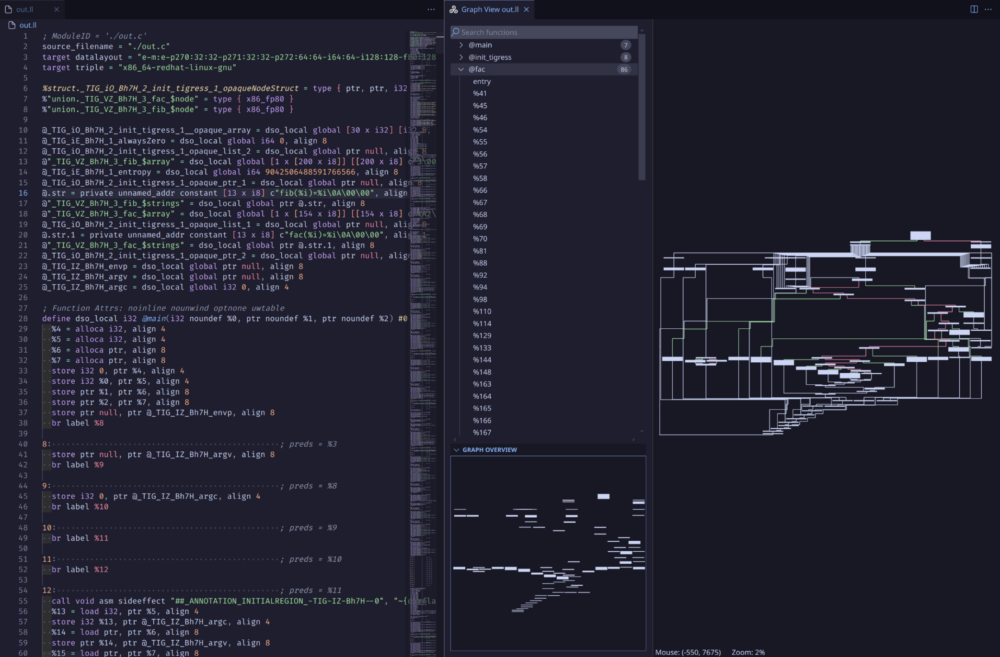
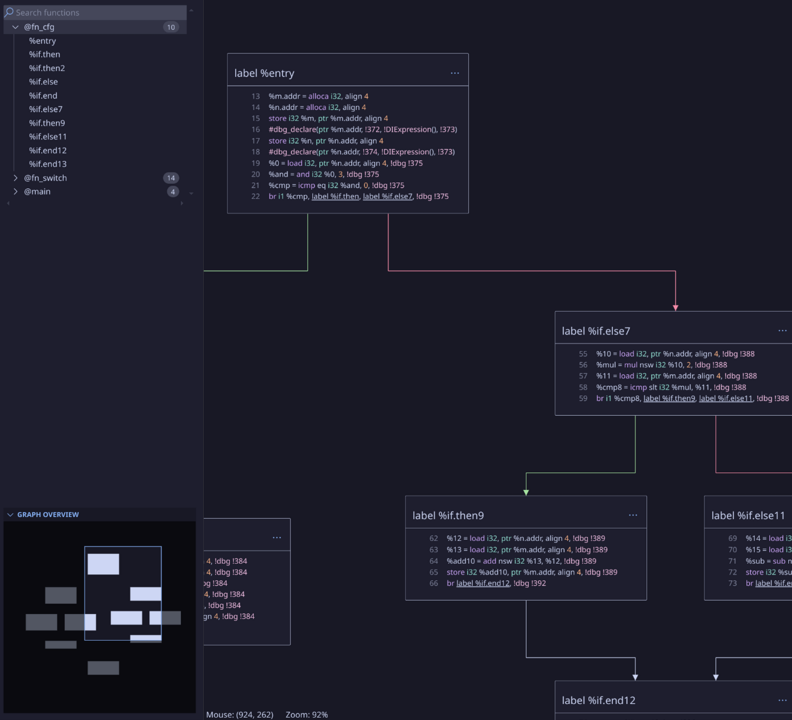
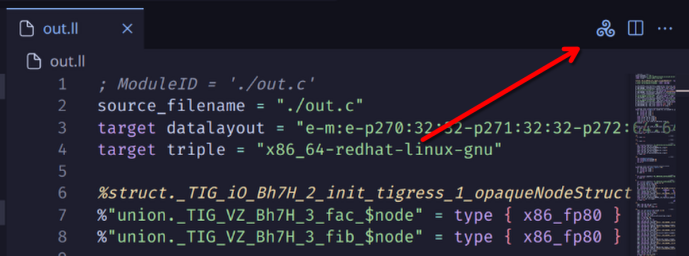

# LLVM Graph View

An interactive graph view for `.ll` files, powered by the [Triskel](https://github.com/triskellib/triskel) graph layout engine.

## Quick Start

To view the graph of a `.ll` file, click the **Triskel** icon at the top right of the screen.

## Features

### Function Selection
Use the search bar to search for function names or basic block labels within the selected function.

### Graph View Controls
- **Pan**: Middle-click and drag.
- **Zoom**: Scroll to zoom in/out.
- **Reset Zoom**: Right-click to set zoom level to 100%.
- **Center Graph**: Right-click to center the graph view.

### Block Interaction
- **Ellipsis Menu**: Click the "..." menu to:
  - Center the view on the current block.
  - Copy the block's contents.
  - Go to the block’s location in the text editor.
- **Jump to Line**: Click on an instruction to navigate the text editor to the corresponding line.
- **Block Labels**: Click on labels to jump to the associated block.

### Graph Overview
- **Center View**: Click to center the view on the cursor.
- **Move View**: Drag to reposition the view.

### Text Editor Integration
- **Sync to Graph**: Right-click and select **Sync Graph View** to jump to the corresponding instruction in the graph view.

## Performance

The extension has been tested with `.ll` files containing up to 2K lines and functions with ~100 nodes. Performance may vary with larger files.

## Errors & Feedback

This project is in early development. If you encounter any issues or bugs, please report them along with the problematic `.ll` file.

## Feature Requests

Have a feature in mind? Feel free to submit your request!
